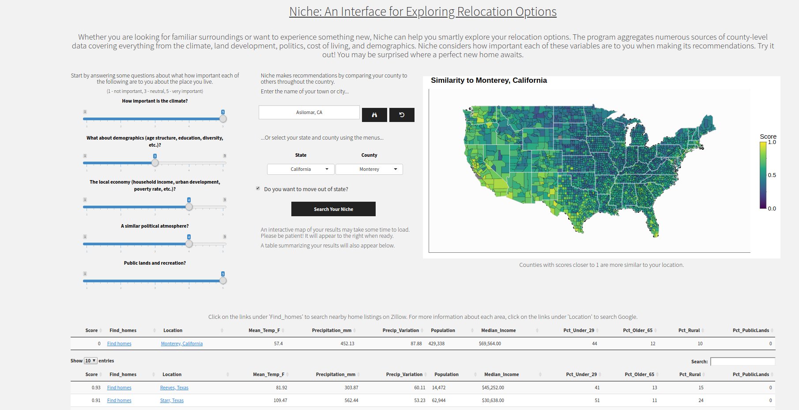

```{r setup, include=FALSE}
knitr::opts_chunk$set(echo = TRUE)

##Load packages
library(sf)
library(raster)
library(sp)
library(tidyverse)
library(dplyr)
library(stringr)
library(readr)
library(rgdal)
library(raster)
library(caTools)
library(maptools)
library(plotly)
library(maps)
library(rgeos)
library(geosphere)
library(jsonlite)
library(magrittr)

# #--(0) Universal variables
p4s_ll <- CRS("+proj=longlat")

```
Lately, my parents will often bring up in conversation their desire to move away from their California home and find a new place to settle down for retirement. Typically they will cite factors that they perceive as having altered the essence of their suburban and rural county such as higher costs of living, population growth, worsening traffic, and growing rates of violent crime that they say have made them feel estranged from their community in recent years. Despite these concerns, both admit that there is much they would miss about their current home such as the mild climate of the California coast, the abundant natural beauty of the region, and an vast matrix of open space and public lands that allow them to enjoy outdoor hobbies throughout the year.

The idea for Niche came from wanting to help my parents explore their relocation options by taking into consideration what matters most to them about the place they live now. The name of this app is taken from a foundational concept in biology. While many definitions of a niche exist, from verbal models to mathematical frameworks, virtually all definitions agree that one's niche can be thought of as the set of environmental conditions necessary for an organism to thrive. While some species can only tolerate a narrow range of conditions (think temperature, light, salinity, etc.) others will do just fine when exposed to large changes in these same variables. But even members of the same species will occupy a different niche due to the individual variation that exists in their anatomy, physiology, and behavior. The point is that no two individuals experience a shared environment in exactly the same way. We all have different tolerances.

Borrowing from this concept, it is easy to imagine how our own ability to thrive will be influenced by our surroundings. Niche works by asking users to identify a location where they would like to live and answer a few questions about what is important to them about that place. The program then identifies other areas in the country with similar features before making recommendations on relocation options. Niche considers both the more salient characteristics of a location such as the climate and land uses as well as factors that may be less conspicuous such as economic, demographic, and political indicators. Niche relies on the belief that the best tools to guide our understanding of the conditions best suit us as individuals will come from reflecting on our experiences. You know what you want to find in the places you want to live and Niche can help you find them.


[**Try the Niche app right now. Click here!**](https://ericvc.shinyapps.io/Niche)

Below, I detail the data and methods that went into creating Niche. Thank you for reading. If you have any feedback, questions, or suggestions get in touch with me at ericvc2[at]gmail.

## 0. Get County-level Boundary Data, the unit of this analysis

Before getting started, I needed to aquire a geospatial data set for all of the counties in the contiguous 48 U.S. states. Fortunately, `ggplot2` packages makes this easy with the `ggplot2::map_data()` function. However, I knew that I would eventually like to have the data as an 'sf' type object used by the `sf` ("simple features") geospatial package. Therefore, I had to first download the county level data using `ggplot2`, convert the coordinate data into a 'Spatial*' object (used by the `sp` package), save this data to local storage as a shapefile, and finally read the file back into R using `sf::st_read()`. I decided to save the data as a shapefile as an intermediate data prodcut because the conversion to 'SpatialPolygonsDataFrame' was non-trivial ([this code helped](https://stackoverflow.com/questions/21759134/convert-spatialpointsdataframe-to-spatialpolygons-in-r>)) and took a bit of time to finish.

```{r county_data, eval=FALSE}
library(ggplot2)
county_df <- map_data("county") %>%
  mutate(region = tolower(region)) %>%
  mutate(subregion = tolower(subregion)) %>%
  mutate(subregion = str_replace(subregion, "st ", "saint ")) %>%
  mutate(subregion = str_replace(subregion, "ste ", "saint ")) %>%
  mutate(region = str_replace(region, "\\s", "_")) %>%
  mutate(subregion = str_replace(subregion, "\\s", "_")) %>%
  mutate(id = paste(subregion, region, sep=",_"))
coordinates(county_df) = c("long","lat") #converts to SpatialPointsDataFrame

#convert to SpatialPolygonsDataFrame
#https://stackoverflow.com/questions/21759134/convert-spatialpointsdataframe-to-spatialpolygons-in-r
points2polygons <- function(df,data) {
  get.grpPoly <- function(group,ID,df) {
    Polygon(coordinates(df[df$id==ID & df$group==group,]))
  }
  get.spPoly  <- function(ID,df) {
    Polygons(lapply(unique(df[df$id==ID,]$group),get.grpPoly,ID,df),ID)
  }
  spPolygons  <- SpatialPolygons(lapply(unique(df$id),get.spPoly,df))
  SpatialPolygonsDataFrame(spPolygons,match.ID=T,data=data)
}

sp_dat = county_df$id %>%
  unique() %>%
  factor() %>%
  data.frame(name=.)
rownames(sp_dat) = sp_dat$name
sp_dat$id = as.numeric(sp_dat$name)

counties <- points2polygons(county_df, sp_dat) #this may take a moment
locs = counties$name %>%
  as.character() %>%
  strsplit(split = ",_") %>%
  do.call("rbind", .)
counties$county = locs[,1]
counties$state = locs[,2]
```

Once completed, I had a map of the United States composed of polygons for each county. Now, any new columns added to `d` (an 'sf' object) will be automatically georeferenced.

```{r county_data_plot, echo=TRUE, fig.align="center"}
d <- st_read("raw_data/shape/counties.shp", quiet = TRUE)
st_crs(d) <- CRS("+proj=longlat")

print(d$geometry)

d %>%
  ggplot() + 
    theme_minimal() +
    geom_sf(fill="steelblue", color="white", size=0.1)
    

```

## 1. Climatic Variables from WorldClim

To characterize the climatic conditions for each county, I turned to WorldClim's global climate database, specifically their 'bioclim' collection of annual climate summary measurements. As with the county-level polygons, there exists an API for downloading these files directly from R, this time using the `raster::getData()` function. Below is the code for downloading 'bioclim' data at a resolution of 5 arc minutes, or approximately 64 km$^2$ per grid cell at latitudes considered here.

```{r bioclim_dl, eval=FALSE}
##Download environmental variables
getData('worldclim', var='bio', res=2.5, path = "raw_data/") #123 MB download
varsToGet = c("tmean","tmin","tmax","prec","bio","alt")
sapply(varsToGet, function(x) getData(name = "worldclim", download = TRUE, res=10, var=x))

#bioclim variables (https://worldclim.org/raw_data/bioclim.html)
# BIO1 = Annual Mean Temperature
# BIO2 = Mean Diurnal Range (Mean of monthly (max temp - min temp))
# BIO3 = Isothermality (BIO2/BIO7) (×100)
# BIO4 = Temperature Seasonality (standard deviation × 100)
# BIO5 = Max Temperature of Warmest Month
# BIO6 = Min Temperature of Coldest Month
# BIO7 = Temperature Annual Range (BIO5-BIO6)
# BIO8 = Mean Temperature of Wettest Quarter
# BIO9 = Mean Temperature of Driest Quarter
# BIO10 = Mean Temperature of Warmest Quarter
# BIO11 = Mean Temperature of Coldest Quarter
# BIO12 = Annual Precipitation
# BIO13 = Precipitation of Wettest Month
# BIO14 = Precipitation of Driest Month
# BIO15 = Precipitation Seasonality (Coefficient of Variation)
# BIO16 = Precipitation of Wettest Quarter
# BIO17 = Precipitation of Driest Quarter
# BIO18 = Precipitation of Warmest Quarter
# BIO19 = Precipitation of Coldest Quarter
```

With the raw climate data saved to a local directy, the *.bil files are identified, sorted by name, and queued for import back into the R environment.

```{r bioclim, eval=TRUE, fig.align="center"}
bclimFiles = list.files("raw_data/wc5/", pattern = "bio", full.names = TRUE)[-1]
bclimFiles = bclimFiles[str_detect(bclimFiles, "bil")==TRUE]
orderFiles = str_extract_all(bclimFiles, pattern="[[:digit:]]+") %>%
  do.call("rbind",.) %>%
  as.matrix %>%
  apply(., 2, as.numeric)
orderFiles = order(orderFiles[,2])
bioclim = stack(bclimFiles[orderFiles]) %>%
  crop(., extent(d) + c(-1,1) + 2)

plot(bioclim, col=viridis::viridis(15))
```
**Feature extraction using principal components analysis**
The data set includes 19 variables but deal mostly with characterizing temperature and precipitation patterns. As a result, we might expect that many of these variables will be highly correlated with one another, and would want to consider using feature extraction to distill the variation to fewer dimensions.

Indeed, what I have chosen to do here is perform principal components analysis (PCA) on the climate data in order to collapse raw variables into a smaller number of axes. Before I did that, however, it was important to first normalize each variable by centering each around its mean and re-scaling the variance to 1 by dividing measurements by their standard deviation. After processing the data and performing the PCA, I found that approximately 85% of the total variation could was captured by the first four principal components, and chose to hold onto these axes of variation in order to characterize climatic variation in the data set.

```{r bioclim_pca, fig.align="center"}
#normalize data to mean 0 and unit variance
normalize <- function(x){
  mu <- mean(x, na.rm=TRUE)
  sigma <- sd(x, na.rm=TRUE)
  y <- (x-mu)/sigma
  return(y)
}

i = 1:19
vals <- getValues(bioclim[[i]])
completeObs <- complete.cases(vals)
vals2 <- apply(vals, 2, normalize)

pc <- princomp(vals2[completeObs,], scores = TRUE, cor = TRUE)
pc$loadings[,1:4]

pcPredict <- predict(pc, vals)

r1 = r2 = r3 = r4 = raster(bioclim)
r1[] = pcPredict[,1]
r2[] = pcPredict[,2]
r3[] = pcPredict[,3]
r4[] = pcPredict[,4]
pcClim = stack(r1,r2,r3,r4)
saveRDS(pcClim, file = "raw_data/bioclim_pca_rasters.rds")

pcClim = readRDS("raw_data/bioclim_pca_rasters.rds")
names(pcClim) = c("CLIM_PC1","CLIM_PC2","CLIM_PC3","CLIM_PC4")
par(mfrow=c(2,2))
plot(pcClim, col=viridis::viridis(15))
```

Finally, we can extract the principal component values from the county-level polygons.

```{r bioclim_extract, eval=TRUE}
bioclim_ex = raster::extract(
  pcClim,
  d,
  fun = mean
)

d = cbind(d, bioclim_ex)
```


## 2. Demographic, Political, and Economic Indicators

The data for demographic, political, and economic variables come from a combination of two different county level data sources. The **MIT Election Lab** provides the 'election-context-2018' data set via their [GitHub page](https://github.com/MEDSL/2018-elections-unoffical/blob/master/election-context-2018.csv), which includes information on the outcomes of state and national elections in addition to an impressive variety of demographic variables for each county (e.g, total population, median household income, education, etc.). Though extensive, I chose to complement these data with poverty rate estimates provided by the [U.S. Census Bureau](https://www.census.gov/data-tools/demo/saipe/). Combining these data tables with the 'master' data table object (`d`) was a cinch using the `dplyr::left_join()` function.

```{r pde, eval=TRUE, fig.align="center"}

countyDemo = "raw_data/2018-elections-context.csv" %>% 
  read.csv(stringsAsFactors = FALSE) %>%
  mutate(state = tolower(state)) %>%
  mutate(county = tolower(county)) %>%
  mutate(county = str_replace(county, "st ", "saint ")) %>%
  mutate(county = str_replace(county, "ste ", "saint ")) %>%
  mutate(state = str_replace(state, "\\s", "_")) %>%
  mutate(county = str_replace(county, "\\s", "_")) %>%
  mutate(name = paste(county, state, sep=",_")) %>%
  filter(!duplicated(name)) %>%
  mutate(total_population = log(total_population)) %>%
  mutate(white_pct = asin(white_pct/100)) %>%
  mutate(black_pct = asin(black_pct/100)) %>%
  mutate(hispanic_pct = asin(hispanic_pct/100)) %>%
  mutate(foreignborn_pct = asin(foreignborn_pct/100)) %>%
  mutate(age29andunder_pct = asin(age29andunder_pct/100)) %>%
  mutate(age65andolder_pct = asin(age65andolder_pct/100)) %>%
  mutate(rural_pct = asin(rural_pct/100)) %>%
  mutate(lesshs_pct = asin(lesshs_pct/100))

countyPoverty = "raw_data/2018-county-poverty-SAIPESNC_25AUG20_17_45_39_40.csv" %>%
  read.csv(stringsAsFactors = FALSE) %>%
  mutate(Median_HH_Inc = str_remove_all(Median.Household.Income.in.Dollars, "[\\$|,]")) %>%
  mutate(Median_HH_Inc = as.numeric(Median_HH_Inc)) %>%
  mutate(Median_HH_Inc = log(Median_HH_Inc)) %>%
  mutate(poverty_pct = asin(All.Ages.in.Poverty.Percent/100))

countyAll = countyDemo %>% 
  left_join(countyPoverty, by=c("fips"="County.ID"))

#Derived variables
#2016 Presidential Election
totalVotes2016 = cbind(countyDemo$trump16,countyDemo$clinton16, countyDemo$otherpres16) %>% rowSums()
countyAll$trump16_pct = (countyDemo$trump16 / totalVotes2016) %>% asin()

#2012 Presidential Election
totalVotes2012 = cbind(countyDemo$obama12,countyDemo$romney12, countyDemo$otherpres12) %>% rowSums()
countyAll$romney12_pct = (countyDemo$romney12 / totalVotes2012)  %>% asin()

social_vars = c("total_population","white_pct","black_pct","hispanic_pct","foreignborn_pct",
                "age29andunder_pct","age65andolder_pct","rural_pct")

economic_vars = c("Median_HH_Inc","clf_unemploy_pct","poverty_pct","lesscollege_pct","lesshs_pct")

political_vars = c("trump16_pct","romney12_pct")

all_vars = c(social_vars,economic_vars,political_vars)

d <- d %>%
  left_join(countyAll[, c("name", all_vars)], by = "name")

ggplot(d) +
  theme_minimal() +
  ggtitle("Population by U.S. County") +
  geom_sf(mapping=aes(fill=total_population), size=0.1, color="gray50") +
  scale_fill_viridis_c("(log scale)")

```

## 3. Public Land and Protected Areas

Both my parents and myself enjoy the outdoors, and are accustomed to having plenty of public lands nearby for a day hike, camping trip, or mountain bike ride.

The **International Union for the Conservation of Nature (IUCN)**  makes available to the public a wonderful geospatial data set covering over 33,000 protected areas in the United States alone. Covering everything from small local nature preserves and city parks to iconic National Parks, the data set is as extensive as it is impressive, but this level of detail also makes it computationally burdensome to work with. Therefore, my first steps in processing this data were removing regions of the world not considered here as well as those protected land categories unrelated to recreation.

```{r public_lands_prep, eval=FALSE}
# https://www.iucn.org/theme/protected-areas/about/protected-area-categories
##Subset / clean data
#read into workspace
wdpa = readOGR("raw_data/WDPA/WDPA_Apr2020_USA-shapefile-polygons.shp")
#PAs in contiguous United States
rmPA = c("US-AK","US-N/A;US-AK","US-N/A","US-HI","US-N/A;US-AK","US-N/A;US-CA","US-N/A;US-FL","US-N/A;US-FL;US-GA;US-SC","US-N/A;US-HI")
wdpa_48 = wdpa[!wdpa$SUB_LOC %in% rmPA,]
#Only terrestrial parks
wdpa_48_terr = wdpa_48[wdpa_48$MARINE==0,]
#Subset by PA type
paLevels = c("Ib","II","III","V","VI")
wdpa_48_terr_pa = wdpa_48_terr[wdpa_48_terr$IUCN_CAT %in% paLevels,]
writeSpatialShape(wdpa_48_terr_pa, fn = "raw_data/WDPA/Derived/public_lands_recreation.shp", factor2char = TRUE)
```

After paring the data down, the intermediate product is saved to local storage so that I the process would not have to be repeated when re-running this code. From this, the proportional representation of protected land within each county is calculated. With over 3,000 counties in the United States, I knew that this process would take some computing time. In order to speed things up, I decided to parallelize the task with the `foreach` and `doMC` packages. Please note that if you are implementing this code on your own machine, you may need to find substitute packages that are compatible with your operating system. Operating systems require different backends to allow parallelization. The code here was implemented on a Linux machine.

```{r public_lands, eval=FALSE, echo=FALSE, include=TRUE}
#read in pre-processed shapefile
protectedAreas = readOGR("raw_data/WDPA/Derived/public_lands_recreation.shp")
proj4string(protectedAreas) <- crs(d)

#Ia Strict Nature Reserve
#Ib Wilderness Area
#II National Park
#III Natural Monument or Feature
#IV Habitat/Species Management Area
#V Protected Landscape/ Seascape
#VI Protected Landscape + Wildlife Resto.

paLevels = c("Ib","II","III","V","VI")

library(foreach)
library(doMC)
registerDoMC(cores = 4)

#parallel looping
#for each county polygon, find the proportion representation of each PA type
index <- 1:nrow(d)
outMatrix <- foreach(i=index) %dopar% {
  countyPoly <- d[i,] %>%
    as(.,"Spatial") %>%
    gBuffer(., byid = TRUE, width = 0) #fixes topology error (RGEOS)
  z = over(countyPoly, protectedAreas, returnList=TRUE)[[1]]
  if(nrow(z)>0){
    z$IUCN_CAT = factor(z$IUCN_CAT, paLevels)
    z$area = NA
    countyArea = areaPolygon(countyPoly) * 1e-6 #m^2 -> km^2
    for(k in 1:nrow(z)){
      paPoly = protectedAreas[protectedAreas$NAME %in% z$NAME[k],] #%>%
      # gBuffer(., byid = TRUE, width = 0) #fixes topology error (RGEOS)
      z$area[k] = rgeos::gIntersection(countyPoly, paPoly) %>% 
        areaPolygon * 1e-6 #m^2 -> km^2
    }
    with(z, tapply(area, list(IUCN_CAT), function(x) sum(x, na.rm=TRUE))) / countyArea
  } else{
    rep(NA, 5)
  }
  
} %>% 
  do.call("rbind",.) %>% 
  as_tibble

outMatrix[is.na(outMatrix)] <- 0
pa_by_county = data.frame(outMatrix)
names(pa_by_county) <- paste0("PCT_PA_AREA_", paLevels)
pa_by_county$TOT_PA_AREA = rowSums(pa_by_county)
saveRDS(pa_by_county,"pa_by_county.rds")
```

```{r plot_pa, eval=TRUE, echo=TRUE, include=TRUE, fig.align="center"}
pa_by_county <- readRDS("pa_by_county.rds")

#add data to sf object
vars = names(pa_by_county)[-which(colSums(pa_by_county)==0)]
for(v in 1:length(vars)){
  d[vars[v]] <- pa_by_county[[vars[v]]] %>% asin()
}

ggplot(d) +
  theme_minimal() +
  ggtitle("Proportion of Protected Land by U.S. County") +
  geom_sf(mapping=aes(fill=boot::logit(TOT_PA_AREA+0.001)), size=0.1) +
  scale_fill_viridis_c("logit(%)")

```

## 4. National Land Cover data set (2016)

The [National Land Cover Database](https://www.mrlc.gov/data/nlcd-2016-land-cover-conus), a high resolution (30 m x 30 m grid cells) land cover category map produced by the USGS and other federal agencies. Each cell on the map corresponds to one of 16* land cover categories including bare ground, medium intensity development, deciduous forests, cultivated land, and [more](https://www.mrlc.gov/data/legends/national-land-cover-database-2016-nlcd2016-legend). The NLCD data is very much integral to the design of Niche because it provides a powerful way of quantifying some of the most salient characteristics of a location: what lies on top of the land. Maybe your ideal place to live has evergreen forests, small towns, and large expanses of grazing pasture. Perhaps it consists mainly of high intensity development, such as in a metro area, and with little or absent forest and agriculture land uses. The NLCD2016 data can capture represent these characteristics using combinations of these categories.

As with other spatial data extractions, the goal was to iterate over counties in the data set and calculate the proportional representation of each land cover category in that county, and it was here that I ran into some stumbling blocks. The root of these issues was a combination of the sheer size of some U.S. counties and the high spatial resolution of the NLCD2016 data. Initially, I tried to use the `raster::extract()` pull out a vector of values from the cells falling within them, and, as before, to parallelize this task across CPU cores. This worked fine at first, but I quickly encountered large spikes in system memory use followed by crashes of my operating system. The problem was that some large counties (like San Bernardino County, California) are enormous and encompass areas far larger than many U.S. states. Attempting to hold all this data in system memory was just not going to work.

Next, I tried cropping the NLCD2016 map to the spatial extent of the county before attempting to extract data. Operations were indeed much speedier than before, but before long I encountered the same system memory issues as before.

```{r poly_divide, echo=FALSE, warning=FALSE, fig.align="center"}
landUseLevels = c(11:12, 21:24, 31, 41:43, 51:52, 71:74, 81:82, 90, 95)
nlcd <- "raw_data/NLCD/NLCD_2016_Land_Cover_L48_20190424.img" %>%
  raster()
p4s_nlcd <- proj4string(nlcd)

#create polygon grid over county polygon
countyPoly <-
  d[d$name == "san_bernardino,_california", ] %>%
  st_make_valid() %>%
  as(., 'Spatial') %>%
  spTransform(., p4s_nlcd)
grd <-d[d$name == "san_bernardino,_california", ] %>%
  st_make_valid() %>%
  sf::st_make_grid(n = 6) %>%
  st_transform(., crs = st_crs(p4s_nlcd)) %>%
  as(., 'Spatial') %>%
  split(., .@plotOrder)
grd_list <- lapply(grd, function(g)
  crop(countyPoly, g))

plot(countyPoly, main="San Bernardino County, California", sub="Polygon Subdivisions", axes=TRUE, asp=1)
for(i in 1:length(grd_list)){
  col. <- viridis::viridis(15)[1 + i %% 15]
  plot(grd_list[[i]], add = TRUE, col = col.)
}
```
My eventual workaround involved dividing the spatial polygons for large counties into smaller subsets, and then sequentially extracting the map cell values using these sub-polygons in order to avoid a surge in memory use. The results extracted from each polygon were then written to storage in JSON format, under a directory containing all other files for that county. Later, this data can be retrieved and combined with the other files to reconstruct the land cover classes in the entire county. Even still, the entire process took quite some time to complete. On my computer, it took over 16 hours to complete once I had the code worked out.

Here is the full code, with some added conditional statements to check whether files with the same data already exist in storage.
```{r, nlcd, eval=FALSE}

library(foreach)
library(doMC)

s = Sys.time()
registerDoMC(cores = 6)
index = 1:length(counties2)
county_state <- sapply(counties2, function(x)
  x$name) %>%
  as.character()

foreach(i = index) %dopar% {
  #for(i in index){
  name. <- county_state[i]
  fileName <-
    paste0(formatC(i, width = 4, flag = "0"), "_", name.)
  dirName <- sprintf("land_use/%s", fileName)
  if (!dir.exists(dirName)) {
    dir.create(dirName)
  }
  fileOut <- sprintf("%s/%s.json", dirName, fileName)
  if (!file.exists(fileOut)) {
    #countyPoly = counties2[[i]]
    countyPoly = gBuffer(counties2[[i]], byid = TRUE, width = 0) #fixes topology error (RGEOS)
    area. <- (gArea(countyPoly) * 1e-6)
    if (area. > 1e3) {
      dims <-
        ifelse(area. > 2.5e4,
               6,
               ifelse(
                 area. <= 2.5e4 & area. > 1e4,
                 4,
                 ifelse(area. > 1e3 & area. <= 1e4, 2, 1)
               ))
      grd <-
        d[d$name == name., ] %>%
        st_make_valid() %>%
        sf::st_make_grid(n = dims) %>%
        st_transform(., crs = st_crs(p4s_nlcd)) %>%
        as(., 'Spatial') %>%
        split(., .@plotOrder)
      grd_list <- lapply(grd, function(g)
        crop(countyPoly, g))
      sapply(1:length(grd_list), function(j) {
        fileName2 <- str_split(fileName, "_", n = 2) %>%
          unlist()
        fileName2 <-
          paste0(fileName2[1], paste0(".", j, "_"), fileName2[2])
        fileOut2 <- sprintf("%s/%s.json", dirName, fileName2)
        if (!file.exists(fileOut2)) {
          countyPoly = gBuffer(grd_list[[j]], byid = TRUE, width = 0) #fixes topology error (RGEOS)
          nlcd_sub <- crop(nlcd, grd.)
          cellTypes <- raster::extract(nlcd_sub, grd.) %>%
            unlist()
          yf <- factor(cellTypes, landUseLevels) %>%
            table() %>%
            #prop.table() %>%
            data.frame()
          names(yf) <- c("category", "Count")
          jsonlite::write_json(yf, path = fileOut2)
        }
      })
    }
    else{
      nlcd2 <- crop(nlcd, countyPoly)
      cellTypes <- raster::extract(nlcd2, countyPoly) %>%
        unlist()
      yf <- factor(cellTypes, landUseLevels) %>%
        table() %>%
        #prop.table() %>%
        data.frame()
      names(yf) <- c("category", "Count")
      jsonlite::write_json(yf, path = fileOut)
    }
  }
}
```
The data from JSON files can be easily retrieved by iterating a custom 'ingestion' function over the directories for each county. As with the climate data, we want to consider if feature extraction with PCA might be appropriate here given the large number of land cover classes featured in the data set, the presence or absence of which are likely to be correlated with one another.
```{r, ncld2, eval=TRUE, fig.align="center"}
dirs <- list.dirs("land_use/", recursive = TRUE)[-1]

#function for reading and processing the files in each directory (county)
ingest <-  function(x){
  f <- list.files(x, full.names = TRUE)
  d <- lapply(f, function(y){
    z <- read_json(y)
    lapply(z, data.frame) %>% 
      do.call("rbind",.)
  }) %>%
    do.call("rbind",.)
  out <- tapply(d$Count, list(d$category), sum) %>% 
    prop.table()
  return(out)
}

#iterate read and processing function over directories
lc <- lapply(dirs, ingest) %>%
  do.call("rbind",.)
#remove columns for land use categories unique to Alaska
rmCols <- which(attributes(lc)$dimnames[[2]] %in% paste(72:74))

#feature reduction using PCA
pc <- princomp(lc[,-rmCols], scores = TRUE, cor = FALSE)
scores <-pc$scores[,1:4] %>% data.frame()
names(scores) <- vars <- paste0("LandCover_PC",1:4)
par(mfrow=c(2,2))
for(v in 1:length(vars)){
  d[vars[v]] <- scores[[vars[v]]]
}

library(ggplotify)
library(gridExtra)

p1 <- ggplot(d) +
  theme_minimal() +
  ggtitle("Land Cover PC1") +
  geom_sf(mapping=aes(fill=LandCover_PC1), size=0.1) +
  scale_fill_viridis_c("")

p2 <- ggplot(d) +
  theme_minimal() +
  ggtitle("Land Cover PC2") +
  geom_sf(mapping=aes(fill=LandCover_PC2), size=0.1) +
  scale_fill_viridis_c("")

plt <- gridExtra::arrangeGrob(grobs = lapply(list(p1,p2), as.grob), ncol=1)
grid::grid.newpage()
grid::grid.draw(plt)

```

## 5. Making recommendations: cosine proximity

With all of the data in place, it is now time to put the pieces together and make some recommendations about where to potentially move. This works by calculating the distance between the focal county (the basis of the comparison) and all others in the country using the cosine similarity measure. Before getting more into that, the features to include in that calculation need to be isolated and some transformations performed.

```{r features, eval=TRUE}
climate_vars = paste0("CLIM_PC", 1:3)

social_vars = c(
  "total_population",
  "white_pct",
  "black_pct",
  "hispanic_pct",
  "foreignborn_pct",
  "age29andunder_pct",
  "age65andolder_pct",
  "rural_pct"
)

economic_vars = c(
  "Median_HH_Inc",
  "clf_unemploy_pct",
  "poverty_pct",
  "lesscollege_pct",
  "lesshs_pct"
)

political_vars = c("trump16_pct", 
                   "romney12_pct"
                   )

landscape_vars = paste0("LandCover_PC", 1:4)

features = c(climate_vars,
             social_vars,
             economic_vars,
             political_vars,
             landscape_vars)


## Variable transformation function
transform_data <- function(x) {
  min_x = min(x, na.rm = TRUE)
  max_x = max(x, na.rm = TRUE)
  mean_x = mean(x, na.rm = TRUE)
  y = (x - mean_x) / (max_x - min_x)
  return(y)
}


vals <- d[,features]


vals$geometry <- NULL
vals <-  apply(vals, 2, transform_data)
vals_t <- t(vals)
attr(vals_t, "dimnames") <- NULL
    
```

Cosine similarity is a common method used in recommender systems to identify similar entities (books, movies, etc.) on the basis of a vector of data features. In the previous block of code, we created and $N \times M$ matrix where N is the number of features in the data set and M is the number of counties. Cosine similarity works by calculating the angle $\theta_{i,j}$ from the edges formed between the column vector of the focal county $m_{i}$ and a comparison county $m_{j}$ in $n-$dimensional space. The cosine of two vectors that share many properties will have an angle close to 0 and therefore a cosine value near 1. Conversely, dissimilar counties will have lower scores because the angle of their edge will be larger. The formula for calculating cosine similarity is as follows: 


The code for this calculation is given below along with an example for Cook County, IL, which includes the city of Chicago.

```{r cosine, eval=TRUE}
cosine_similarity <- function(x, focal_index, measure = "angle") {
  
  assertthat::assert_that(measure %in% c("angle", "distance"),
                          length(measure) == 1)
  
  cos_prox = rep(NA, ncol(x))
  for (i in 1:ncol(x)) {
    if (focal_index != i) {
      A = x[, focal_index] %>%
        as.matrix(ncol = 1)
      A_norm = (A * A)  %>% sum() %>% sqrt()
      B = x[, i] %>%
        as.matrix(ncol = 1)
      B_norm = (B * B)  %>% sum() %>% sqrt()
      dot_AB = sum(A * B)
      cos_prox[i] = dot_AB / (A_norm * B_norm)
    }
  }
  
  if (measure=="angle")
    return(cos_prox)
  else
    cos_distance = acos(cos_prox) / pi
    return(cos_distance)
}


#Measure cosine distance among counties, relative to focal county
focal_location <- "cook,_illinois"
focal_index <-
  which(d$name == focal_location) #index of focal location
d$cosine_sim <- cosine_similarity(vals_t, focal_index, measure = "angle")

#Top 10 Recommendations
d[order(d$cosine_sim,decreasing = TRUE),c("name","cosine_sim")]

```

The Top 10 recommendations for Cook County residents are presented here. Most similar to Cook County are Suffolk County, MA, a suburb of New York City, and Marion County, IN, which contains the city of Indianapolis.

## Conclusion

This was a brief overview of the data and methods that went into **Niche: An Interface for Exploring Relocation Options**. If you would like to give a try, visit the most up-to-date version on my Shinyapps page [(https://ericvc.shinyapps.io/Niche/)](https://ericvc.shinyapps.io/Niche/) or clone the GitHub directory and run the app from your computer with RStudio. Note, the `app.R` file contains code for initializing a Python virtual environment (using the `reticulate` package), which Niche requires in order to function completely. This code causes issues when executed on my local system. Commenting out the code fixes the issue, but are otherwise required when running the hosted version of the program. Some features will not be available without the ability to execute Python code.

The purpose of Niche is to help guide users' relocation research by translating their personal preferences and past experiences into a data-centric model in order to make recommendations. Some future plans for this tool include adding historical data that would allow users to find locations in the present that are similar to a location *and time* from the recent past.
